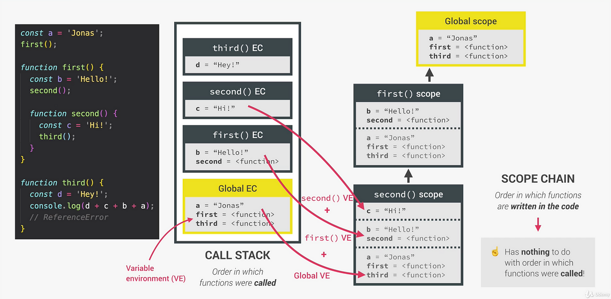
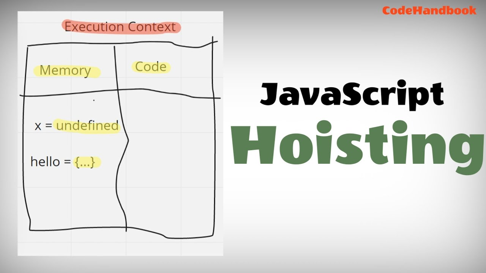
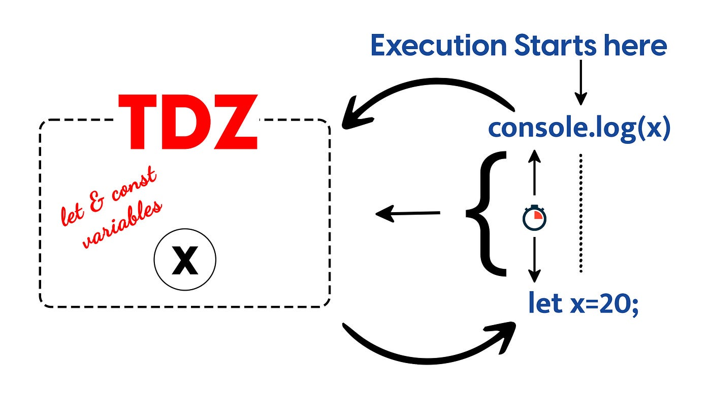

# Scope Hoisting

# Scope 
> Scope ин як Область видимости  аст .
 Як минтакаи муаян аст
# Scope 4 - намуд мешавад
>   1 • Global scope 

>   -  дар любой чо доступ дорад дефавтай. Дар лубой минтака кор мекна

 
  > 2 • Function scope

            > Function scope мебошад ки бо ёри функсия месозем

  > 3 •  Block scope 

         > Миқёси блок майдони дохили ҳалқаҳои if, switch ё for ва while мебошад. 

  > 4 • Module scope:

  > -   - - - - - - - -  - - - - -

# Example

# HOISTING

> Дар JavaScript  HOISTING ин механизм аст чихел механизм механизми болорави аст

### Миқёси блок майдони дохили ҳалқаҳои if, switch ё for ва while мебошад.

# TDZ - Temporal Dead Zone explained

> Ин TDZ аст: истилоҳ барои ҳолате, ки дар он тағирёбандаҳо дастрас нестанд. Онҳо дар миқёс ҳастанд, аммо эълом нашудаанд.

